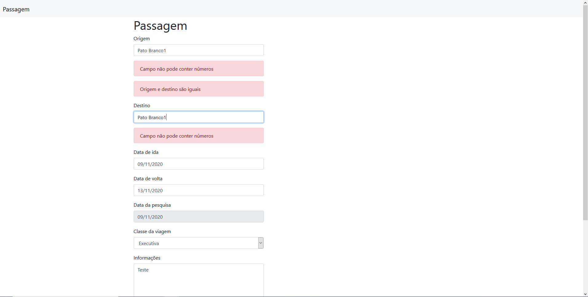

# Validação de formulários Django

Projeto de estudo demonstrando como fazer validações ao submeter formulários(ModelForm) gerados pelo Django.

## Features

1. Validação de caracteres
2. Validação de origem/destino
3. Validação de datas

## Preview

### Index
 
 
## Main requirements

* Django==3.1.2
* django-tempus-dominus==5.1.2.13
* django-widget-tweaks==1.4.8
